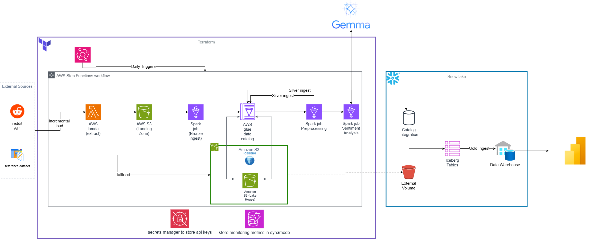

## Market Opinion Data Platform

This repository contains the infrastructure and application code for ingesting Reddit data into an AWS-based data lake, with a scheduled ingestion pipeline, observability, and clear separation of stages using Terraform.

The current scope focuses on **Reddit ingestion into the landing and bronze layers**, with:
- A modular Python ingestion package (`modules/reddit_ingest`).
- An AWS Lambda function that performs **listing-based** ingestion from Reddit.
- A Step Functions state machine triggered by EventBridge on a **schedule**.
- Landing-zone JSONL data in S3, and **Bronze Iceberg tables** populated via AWS Glue.
- **Silver Layer** enrichment with sentiment analysis using Google Gemini Flash.
- Run metadata and checkpoints stored in DynamoDB, plus metrics in CloudWatch.

---


## Repository Structure

- `aws/`
  - `us-east-1/10_s3/` – S3 data lake buckets:
    - Landing zone: raw Reddit data.
    - Lakehouse bucket: Bronze/Silver/Gold Iceberg tables.
  - `us-east-1/11_dynamodb/` – Shared DynamoDB tables:
    - `reddit_ingestion_checkpoints` table for listing-based checkpoints.
    - `lambda_run_logs` table for recording per-run Lambda metadata with timestamp ranges.
    - `glue_ingestion_metrics` table for Glue bronze ingestion metrics.
  - `us-east-1/20_lambda/` – Reddit ingestion Lambda:
    - Lambda function, IAM roles/policies.
    - Uses shared DynamoDB tables from `11_dynamodb` for checkpoints and run metadata.
    - Remote state references to `10_s3` (buckets) and `11_dynamodb` (tables).
  - `us-east-1/21_glue/` – AWS Glue metadata and Bronze ingestion:
    - Landing Glue database for Reddit raw data.
    - Bronze Glue database and Iceberg tables for submissions and comments.
    - Crawlers for landing-zone `submissions.jsonl` and `comments.jsonl`.
    - Glue job for **Bronze ingestion** from landing JSONL to Iceberg tables.
  - `us-east-1/22_glue_enrichment/` – Silver Layer Enrichment:
    - **Silver Core**: Cleans and prepares data for analysis.
    - **Silver Sentiment**: Performs sentiment analysis using Gemini Flash model.
  - `us-east-1/30_stepfunction/` – Step Functions state machine:
    - Orchestrates listing-based ingestion using multiple Lambda invocations.
    - Triggers Bronze and Silver Glue jobs sequentially.
  - `us-east-1/40_eventbridge/` – EventBridge rule and target:
    - Triggers the Step Functions state machine on a schedule.
- `modules/`
  - `reddit_ingest/`
    - `reddit_client.py` – Creates a configured PRAW `Reddit` client from environment variables.
    - `fetchers.py` – Core fetcher utilities (e.g., `CommentFetcher` and retry helpers).
    - `simple_listing_fetcher.py` – `SimpleListingFetcher` for `/top` and `/controversial` listings.
    - `serializers.py` – Converts PRAW `Submission`/`Comment` objects into JSON-safe dicts.
    - `s3_storage.py` – `S3JsonlWriter` that writes JSONL records directly to S3.
    - `ingestion_service.py` – Orchestrates fetching, serialization, and writing.
    - `state_store.py` – DynamoDB-backed checkpoint store for listing-based ingestion.
    - `run_metadata.py` – Persists run metadata to DynamoDB and publishes CloudWatch metrics.
  - `sentiment_analysis/`
    - `gemini_client.py` – Async client for Google Gemini API with rate limiting.
    - `prompt_builder.py` – Constructs prompts for sentiment analysis.
    - `normalizer.py` – Standardizes brand and product names.
- `lambda/`
  - `ingestion/handler.py` – AWS Lambda handler wiring together the Reddit client, listing fetcher, ingestion service, checkpoint store, and run recorder.
- `scripts/`
  - `build_lambda.sh` – Builds the Lambda deployment ZIP using `lambda/ingestion/requirements.txt`.
- `tests/`
  - Pytest-based tests for `modules/reddit_ingest` (fetchers, listing fetcher, ingestion service).
- `run_reddit_backfill.sh`
  - Backfill driver that launches Step Functions executions over a historical time range.
- `build/`
  - Contains generated Lambda ZIP artifacts (not checked in, but used during deployment).

---

## Ingestion Architecture

### High-Level Flow

```
EventBridge (schedule)
    │
    ▼
Step Functions (reddit_listing_ingestion)
    │
    ├─► Compute PROCESS_DATE from execution start time
    │
    ├─► For each (subreddit, sort_type):
    │       └─► Lambda (reddit-ingestion)
    │               └─► Write JSONL to S3 landing zone
    │
    ├─► Glue Job (reddit_bronze_ingestion)
    │       └─► Read fresh partition → MERGE into Bronze Iceberg tables
    │
    ├─► Glue Job (reddit_silver_core)
    │       └─► Clean & Prepare data → Silver Core Iceberg tables
    │
    └─► Glue Job (reddit_silver_sentiment)
            └─► Analyze Sentiment (Gemini) → Silver Sentiment Iceberg tables
```

1. **Schedule (EventBridge + Step Functions)**
   - An EventBridge rule in `aws/us-east-1/40_eventbridge` triggers the `reddit_listing_ingestion` Step Functions state machine on a configured schedule (for example, daily at midnight UTC).
   - The Step Function:
     1. Computes `PROCESS_DATE` from the execution start time (format: `DD-MM-YYYY`) OR uses the provided `process_date` input.
     2. Fans out into multiple Lambda invocations, each handling a single `(subreddit, sort_type)` listing ingestion.
     3. Triggers Glue Bronze ingestion, followed by Silver Core and Silver Sentiment jobs, passing the `PROCESS_DATE`.

2. **Lambda Handler (`lambda/ingestion/handler.py`)**
   - Reads configuration from environment variables:
     - `LANDING_BUCKET_NAME`, `LANDING_BUCKET_PREFIX`.
     - `REDDIT_SECRET_ARN` (Secrets Manager ARN).
     - `DEFAULT_SUBREDDIT`.
     - `ENVIRONMENT`.
     - `RUNS_TABLE_NAME`, `CHECKPOINTS_TABLE_NAME`.
     - `METRICS_NAMESPACE`.
   - Loads Reddit API credentials from Secrets Manager.
   - Validates the incoming event:
     - `subreddit` (default from `DEFAULT_SUBREDDIT` if omitted).
     - `sort_type` in `("top", "controversial")`.
     - Optional `time_filter`, `max_items`, and `include_comments`.
   - Builds an S3 prefix of the form:
     - `reddit/{sort_type}/subreddit={subreddit}/date=DD-MM-YYYY/`.
   - Wires together:
     - `RedditClientFactory` → PRAW `Reddit` client.
     - `SimpleListingFetcher` → listing-based submissions iterator.
     - `CommentFetcher` → comment expansion for each submission.
     - `S3JsonlWriter` → JSONL writers for submissions and comments.
     - `RedditIngestionService` → orchestrates the fetch/write flow.
     - `RedditCheckpointStore` → persists listing checkpoints.
     - `RedditIngestionRunRecorder` → records run metadata and metrics.

3. **Reddit Ingestion (`modules/reddit_ingest`)**
   - **Client**: `RedditClientFactory.create()` builds a PRAW client from env vars:
   - `REDDIT_CLIENT_ID`, `REDDIT_CLIENT_SECRET`, `REDDIT_USER_AGENT`.
   - **Fetchers**:
   - `SimpleListingFetcher.fetch_listing(subreddit_name, sort_type, time_filter, limit)` reads submissions from `/top` or `/controversial` for a subreddit, respecting a maximum item limit.
   - `CommentFetcher.iterate_comments(submission)` expands and flattens all comments for a submission.
   - **Serialization**:
   - `SubmissionSerializer.to_dict` and `CommentSerializer.to_dict` produce JSON-safe dicts, including useful fields like author, scores, `created_utc`, and awards.
   - Each record carries a stable Reddit **fullname identifier** (`fullname_id`, e.g. `t3_xxx` for submissions, `t1_xxx` for comments) and an **`updated_at`** unix timestamp representing when the ingestion run observed that object.
   - Downstream consumers should treat the S3 JSONL as an **append-only event stream** and perform **upserts keyed by `fullname_id`**, keeping the latest `updated_at` per id.
   - **Storage**:
   - `S3JsonlWriter` writes each serialized object as a JSON line into S3, with optional rotation and buffering:
       - S3 key pattern: `reddit/{sort_type}/subreddit={subreddit}/date=DD-MM-YYYY/submissions.jsonl` and `comments.jsonl`.
   - **Service**:
   - `RedditIngestionService.ingest_listing(subreddit_name, simple_fetcher, sort_type, time_filter="all", max_items=1000, include_comments=True)`:
       - Uses `SimpleListingFetcher` to stream submissions from a single listing endpoint.
       - Optionally fetches and writes all comments for each submission.
       - Returns a `RedditIngestionResult` with:
         - `subreddit`, `submissions_count`, `comments_count`, `s3_prefix`, `sort_type`, `time_filter`.
       - Logs start/end of each ingestion run (subreddit, sort type, counts).

4. **State Management (`modules/reddit_ingest/state_store.py`)**
   - `RedditCheckpointStore` uses the shared `reddit_ingestion_checkpoints` DynamoDB table from `11_dynamodb` to persist listing checkpoints:
     - Keys:
       - `pk = "ENV#{environment}#SUBREDDIT#{subreddit}"`.
       - `sk = "CHECKPOINT#{checkpoint_type}#{sort_type}#{time_filter}"` for listing checkpoints.
     - Attributes:
       - `LastToken`, `LastTimestamp`, `SortType`, `TimeFilter`, `ItemsFetched`, `S3Location`.
   - Checkpoints can be used to understand which listings were already ingested, how many items were fetched, and where they were written in S3.

5. **Run Metadata and Metrics (`modules/reddit_ingest/run_metadata.py`)**
   - `RedditIngestionRunRecorder`:
     - Writes a record per ingestion run into the generic `lambda_run_logs` DynamoDB table from `11_dynamodb`:
       - `pk = "ENV#{environment}#SUBREDDIT#{subreddit}"`.
       - `sk = "RUN#{run_timestamp}#{sort_type}"`.
       - Attributes include `SubmissionsCount`, `CommentsCount`, `Mode`, `SortType`, `TimeFilter`, `S3Prefix`, `IngestedAtTs`.
       - **New timestamp fields**: `EarliestSubmissionCreatedUtc`, `LatestSubmissionCreatedUtc`, `EarliestCommentCreatedUtc`, `LatestCommentCreatedUtc`.
     - Publishes CloudWatch metrics for each run:
       - Namespace: `RedditIngestion`.
       - Metrics:
         - `SubmissionsFetched` (Count).
         - `CommentsFetched` (Count).
         - `SubmissionTimeSpanSeconds` (Seconds) – span between earliest and latest submission.
         - `CommentTimeSpanSeconds` (Seconds) – span between earliest and latest comment.
         - `EarliestSubmissionAge`, `LatestSubmissionAge` (Unix timestamps).
       - Dimensions: `Environment`, `Subreddit`, `SortType`.
   - All operations log successes and failures via the module logger.

---

## Terraform Stages and Modules

### `10_s3`

Located at `aws/us-east-1/10_s3/`:

- Provisions S3 buckets using `terraform-aws-modules/s3-bucket/aws`:
  - **Landing zone bucket**: `${local.name_prefix}-lz`
  - **Lakehouse bucket**: `${local.name_prefix}-lakehouse`
- Buckets enforce:
  - Blocked public access.
  - Server-side encryption (SSE-S3 or KMS).
- Outputs:
  - `s3_landing_zone_bucket_id`, `s3_landing_zone_bucket_arn`
  - `s3_lakehouse_bucket_id`, `s3_lakehouse_bucket_arn`

The Lambda stack (`20_lambda`) reads these outputs via `terraform_remote_state`.

### `11_dynamodb`

Located at `aws/us-east-1/11_dynamodb/`:

- Provisions shared DynamoDB tables:
  - `reddit_ingestion_checkpoints` – listing-based checkpoint store.
  - `lambda_run_logs` – Lambda run metadata with timestamp ranges.
  - `glue_ingestion_metrics` – Glue bronze ingestion metrics (aggregate and per-subreddit).
- Tables use:
  - Partition key: `pk` (string).
  - Sort key: `sk` (string).
- Outputs:
  - Table names and ARNs for use in other stacks.

### `20_lambda`

Located at `aws/us-east-1/20_lambda/`:

- **Backend**: Uses the same S3 backend as other stages with key `20_lambda/terraform.tfstate`.
- **Provider**: Standard AWS provider configured via variables.
- **Data sources**:
  - `terraform_remote_state.s3` – fetch S3 bucket names/ARNs from `10_s3`.
  - `terraform_remote_state.dynamodb` – fetch DynamoDB table names/ARNs from `11_dynamodb`.
  - `aws_caller_identity.current`, `aws_region.current`.
- **Locals**:
  - `name_prefix` for consistent Lambda-related naming.
  - `landing_bucket_name`, `landing_bucket_arn`, `reddit_prefix = "reddit/"`.
  - `checkpoints_table_name`, `lambda_run_logs_table_name` derived from `11_dynamodb` remote state.
- **Resources**:
  - `aws_lambda_function.reddit_ingestion`:
    - Handler: `handler.lambda_handler`.
    - Runtime: `python3.11`.
    - Deployed from a ZIP artifact built under `build/reddit_ingestion_lambda/`.
    - Environment variables:
      - `LANDING_BUCKET_NAME`, `LANDING_BUCKET_PREFIX`.
      - `REDDIT_SECRET_ARN` (Secrets Manager ARN).
      - `DEFAULT_SUBREDDIT`.
      - `ENVIRONMENT`.
      - `RUNS_TABLE_NAME` (DynamoDB run logs table).
      - `CHECKPOINTS_TABLE_NAME` (DynamoDB checkpoints table).
      - `METRICS_NAMESPACE` (CloudWatch namespace).
  - IAM resources:
    - `aws_iam_role.reddit_ingestion_lambda` with `lambda.amazonaws.com` trust.
    - `aws_iam_policy.reddit_ingestion_inline` attached to the role:
      - CloudWatch Logs (log groups/streams/events).
      - S3 `PutObject` / `AbortMultipartUpload` to the landing bucket under `reddit/`.
      - Secrets Manager `GetSecretValue` for the Reddit credentials secret.
      - DynamoDB `PutItem` / `GetItem` on the checkpoints and run logs tables.
      - CloudWatch `PutMetricData` for publishing ingestion metrics.

### `21_glue`

Located at `aws/us-east-1/21_glue/`:

- **Backend**: Uses the same S3 backend with key `21_glue/terraform.tfstate`.
- **Resources**:
  - Landing Glue database for Reddit raw data.
  - Bronze Glue database with Iceberg tables:
    - `submissions` and `comments` with explicit schemas.
  - Crawlers over the landing bucket under the `reddit/` prefix:
    - One for `submissions.jsonl`.
    - One for `comments.jsonl`.
  - S3 object for `scripts/reddit_bronze_ingestion.py`.
  - Glue job `reddit_bronze_ingestion`:
    - Reads landing JSONL files.
    - Adds audit columns (`ingestion_timestamp`, `source_file`, `source_sort_type`, `partition_date`).
    - Filters to **only the fresh partition** when `--PROCESS_DATE` is provided.
    - Writes into Bronze Iceberg tables using MERGE semantics (upsert by `id`, keep latest `updated_at`).
    - **Metrics**: Computes per-subreddit and aggregate metrics (counts, timestamp ranges) and writes to DynamoDB and CloudWatch.
    
### `22_glue_enrichment`

Located at `aws/us-east-1/22_glue_enrichment/`:

- **Resources**:
  - **Silver Core Job**: Cleanses Bronze data, handles deduplication, and prepares it for analysis.
  - **Silver Sentiment Job**:
    - Reads from Silver Core tables.
    - Uses `modules/sentiment_analysis` to call Gemini Flash API.
    - Performs aspect-based sentiment analysis on submissions and comments.
    - Writes results to `sentiment_results` Iceberg table.
    - **Optimization**: Uses `asyncio` for concurrent API calls and rate limiting.

### `30_stepfunction`

Located at `aws/us-east-1/30_stepfunction/`:

- **Backend**: Uses the same S3 backend with key `30_stepfunction/terraform.tfstate`.
- **Data sources**:
  - `terraform_remote_state.lambda` – fetch Lambda ARN from `20_lambda`.
  - `terraform_remote_state.glue` – fetch Glue job name from `21_glue`.
- **Resources**:
  - IAM role for Step Functions with permissions to:
    - Invoke the ingestion Lambda.
    - Start the Glue bronze ingestion job.
  - `aws_sfn_state_machine.reddit_listing_ingestion`:
    - Definition loaded from `listing_ingestion_state_machine.asl.json`.
    - **State machine flow**:
      1. `ComputeProcessDate` – Extracts date from `$$.Execution.StartTime` (or uses input `process_date`).
      2. `FormatProcessDate` – Formats date as `DD-MM-YYYY` to match S3 partition structure.
      3. `GenerateInvocations` – Prepares the list of `(subreddit, sort_type)` combinations.
      4. `ProcessSubreddits` – Map state that invokes Lambda for each combination.
      5. `StartBronzeIngestion` – Starts the Bronze Glue job.
      6. `StartSilverCore` – Starts the Silver Core Glue job.
      7. `StartSilverSentimentAnalysis` – Starts the Silver Sentiment Glue job.

### `40_eventbridge`

Located at `aws/us-east-1/40_eventbridge/`:

- **Backend**: Uses the same S3 backend with key `40_eventbridge/terraform.tfstate`.
- **Data sources**:
  - `terraform_remote_state.stepfunction` – fetch Step Function ARN from `30_stepfunction`.
- **Resources**:
  - `aws_cloudwatch_event_rule.reddit_ingestion_schedule`:
    - `schedule_expression` (for example `rate(1 hour)`).
  - `aws_cloudwatch_event_target.reddit_ingestion_stepfunction`:
    - Targets the `reddit_listing_ingestion` Step Function.
  - IAM role for EventBridge to start Step Function executions.

---

## Fresh Partition Processing and Backfills

### PROCESS_DATE

The `PROCESS_DATE` parameter (format: `DD-MM-YYYY`) controls which S3 partition the Glue bronze ingestion job processes:

- **Automated runs**: The Step Function computes `PROCESS_DATE` from the execution start time and passes it to the Glue job. This ensures only freshly ingested data is processed.
- **Standalone Glue runs**: If `--PROCESS_DATE` is not provided, the Glue job defaults to today's UTC date.

### Manual Backfills

To process historical partitions, you can:

1. **Run the Glue job directly** with a specific `PROCESS_DATE`:
   ```bash
   aws glue start-job-run \
     --job-name tf-prod-smartcomp-glue-reddit-bronze-ingestion \
     --arguments '{"--PROCESS_DATE":"15-11-2024"}'
   ```

2. **Use the backfill script** (`run_reddit_backfill.sh`) to trigger Step Function executions over a historical time range. Each execution will ingest data for that day and run the Glue job for that partition.

---

## Configuration

### Global variables (`aws/prod.tfvars`)

Typical contents:

```hcl
prefix      = "tf-"
name        = "smartphone-compitition"
owner       = "INFRA_TEAM"
environment = "prod"
region      = "us-east-1"
vpc_cidr    = "10.0.0.0/16"
ManagedBy   = "TERRAFORM"

reddit_secret_arn               = "arn:aws:secretsmanager:us-east-1:ACCOUNT_ID:secret:reddit_api-XXXX"
reddit_ingestion_lambda_package = "/absolute/path/to/build/reddit_ingestion_lambda/reddit_ingestion_lambda.zip"
```

The Lambda package path is set after you build the ZIP locally (see below).

### Reddit API Credentials (Secrets Manager)

The secret referenced by `reddit_secret_arn` must be a JSON document:

```json
{
  "REDDIT_CLIENT_ID": "your-client-id",
  "REDDIT_CLIENT_SECRET": "your-client-secret",
  "REDDIT_USER_AGENT": "your-app-name"
}
```

---

## Building and Deploying the Ingestion Lambda

From the repository root:

```bash
# 1. Build the Lambda artifact
./scripts/build_lambda.sh
```

This script:

- Installs dependencies from `lambda/ingestion/requirements.txt` into a build directory.
- Copies the `lambda/ingestion/handler.py` and `modules/` package.
- Produces `build/reddit_ingestion_lambda/reddit_ingestion_lambda.zip`.

Update `aws/prod.tfvars` to point `reddit_ingestion_lambda_package` to the absolute path of the ZIP if needed.

Then deploy:

```bash
cd ../../aws/us-east-1/10_s3
terraform init
terraform apply -var-file=../../prod.tfvars

cd ../11_dynamodb
terraform init
terraform apply -var-file=../../prod.tfvars

cd ../20_lambda
terraform init
terraform apply -var-file=../../prod.tfvars

cd ../21_glue
terraform init
terraform apply -var-file=../../prod.tfvars

cd ../30_stepfunction
terraform init
terraform apply -var-file=../../prod.tfvars

cd ../40_eventbridge
terraform init
terraform apply -var-file=../../prod.tfvars
```

---

## Testing the Ingestion Pipeline

### Manual listing-based run

```bash
aws lambda invoke \
  --function-name tf-prod-smartcomp-lambda-reddit-ingestion \
  --payload '{"subreddit":"smartphones","sort_type":"top","time_filter":"all","max_items":200,"include_comments":true}' \
  --cli-binary-format raw-in-base64-out \
  /tmp/reddit_ingestion_listing.json

cat /tmp/reddit_ingestion_listing.json
```

Check:
- DynamoDB: recent items in `lambda_run_logs` table.
- DynamoDB: checkpoints in `reddit_ingestion_checkpoints` table.
- S3: new JSONL objects under `reddit/{subreddit}/...`.
- CloudWatch Logs: INFO logs for window selection, ingestion, recording, and metrics.

## Metrics & Monitoring

The platform provides comprehensive monitoring at two layers: Lambda ingestion and Glue bronze processing.

### DynamoDB Tables

| Table | Purpose | Key Structure |
|-------|---------|---------------|
| `lambda_run_logs` | Per-run Lambda ingestion metadata | `pk=ENV#{env}#SUBREDDIT#{sub}`, `sk=RUN#{ts}#{sort}` |
| `glue_ingestion_metrics` | Per-run Glue bronze metrics (aggregate + per-subreddit) | `pk=ENV#{env}#SUBREDDIT#{sub}` or `ENV#{env}#AGGREGATE`, `sk=GLUE_RUN#{date}#{run_id}` |
| `reddit_ingestion_checkpoints` | Listing-based checkpoint storage | `pk=ENV#{env}#SUBREDDIT#{sub}`, `sk=CHECKPOINT#{type}#{sort}#{time}` |

### Lambda Ingestion Metrics

**DynamoDB Attributes** (`lambda_run_logs` table per run):

| Attribute | Description |
|-----------|-------------|
| `SubmissionsCount` | Number of submissions fetched |
| `CommentsCount` | Number of comments fetched |
| `EarliestSubmissionCreatedUtc` | Unix timestamp of oldest submission in batch |
| `LatestSubmissionCreatedUtc` | Unix timestamp of newest submission in batch |
| `EarliestCommentCreatedUtc` | Unix timestamp of oldest comment in batch |
| `LatestCommentCreatedUtc` | Unix timestamp of newest comment in batch |
| `SortType` | `top` or `controversial` |
| `TimeFilter` | `all`, `year`, `month`, etc. |
| `S3Prefix` | S3 location where data was written |

**CloudWatch Metrics** (Namespace: `RedditIngestion`):

| Metric | Unit | Dimensions |
|--------|------|------------|
| `SubmissionsFetched` | Count | Environment, Subreddit, SortType |
| `CommentsFetched` | Count | Environment, Subreddit, SortType |
| `SubmissionTimeSpanSeconds` | Seconds | Environment, Subreddit, SortType |
| `CommentTimeSpanSeconds` | Seconds | Environment, Subreddit, SortType |
| `EarliestSubmissionAge` | None (Unix timestamp) | Environment, Subreddit, SortType |
| `LatestSubmissionAge` | None (Unix timestamp) | Environment, Subreddit, SortType |

### Glue Bronze Ingestion Metrics

**DynamoDB Attributes** (`glue_ingestion_metrics` table):

For **aggregate runs** (pk=`ENV#{env}#AGGREGATE`):

| Attribute | Description |
|-----------|-------------|
| `TotalSubmissions` | Total submissions processed across all subreddits |
| `TotalComments` | Total comments processed across all subreddits |
| `SubredditsProcessed` | Number of distinct subreddits in the partition |
| `EarliestSubmissionCreatedUtc` | Global earliest submission timestamp |
| `LatestSubmissionCreatedUtc` | Global latest submission timestamp |
| `EarliestCommentCreatedUtc` | Global earliest comment timestamp |
| `LatestCommentCreatedUtc` | Global latest comment timestamp |
| `ProcessDate` | Partition date processed (DD-MM-YYYY) |
| `RunId` | Unique identifier for this job run |

For **per-subreddit runs** (pk=`ENV#{env}#SUBREDDIT#{sub}`):

| Attribute | Description |
|-----------|-------------|
| `SubmissionsCount` | Submissions processed for this subreddit |
| `CommentsCount` | Comments processed for this subreddit |
| `EarliestSubmissionCreatedUtc` | Earliest submission timestamp for this subreddit |
| `LatestSubmissionCreatedUtc` | Latest submission timestamp for this subreddit |
| `EarliestCommentCreatedUtc` | Earliest comment timestamp for this subreddit |
| `LatestCommentCreatedUtc` | Latest comment timestamp for this subreddit |

**CloudWatch Metrics** (Namespace: `RedditBronzeIngestion`):

| Metric | Unit | Dimensions |
|--------|------|------------|
| `SubmissionsProcessed` | Count | Environment, ProcessDate |
| `CommentsProcessed` | Count | Environment, ProcessDate |
| `SubredditsProcessed` | Count | Environment, ProcessDate |
| `SubmissionTimeSpanSeconds` | Seconds | Environment, ProcessDate |
| `CommentTimeSpanSeconds` | Seconds | Environment, ProcessDate |

### Example Queries

**Query Lambda run history for a subreddit:**

```bash
aws dynamodb query \
  --table-name tf-prod-smartcomp-lambda-run-logs \
  --key-condition-expression "pk = :pk" \
  --expression-attribute-values '{":pk":{"S":"ENV#prod#SUBREDDIT#smartphones"}}' \
  --scan-index-forward false \
  --limit 10
```

**Query Glue metrics for a specific date:**

```bash
aws dynamodb query \
  --table-name tf-prod-smartcomp-glue-ingestion-metrics \
  --key-condition-expression "pk = :pk AND begins_with(sk, :sk_prefix)" \
  --expression-attribute-values '{":pk":{"S":"ENV#prod#AGGREGATE"},":sk_prefix":{"S":"GLUE_RUN#09-12-2025"}}'
```

**CloudWatch Insights query for submission counts by subreddit:**

```
fields @timestamp, @message
| filter @message like /SubmissionsFetched/
| stats sum(SubmissionsFetched) by Subreddit
```

---

## Logging & Observability

- All core components (`ingestion_service`, `state_store`, `run_metadata`, and the Lambda handler) use Python's `logging` module:
  - High-level events at `INFO`.
  - Warnings for abnormal-but-non-fatal conditions (e.g., invalid SSM values).
  - Errors for unexpected AWS API or runtime failures.
- Metrics:
  - Lambda: `SubmissionsFetched`, `CommentsFetched`, and timestamp span metrics in CloudWatch under the `RedditIngestion` namespace.
  - Glue: `SubmissionsProcessed`, `CommentsProcessed`, `SubredditsProcessed`, and timestamp span metrics under the `RedditBronzeIngestion` namespace.
- Run history:
  - DynamoDB `lambda_run_logs` table allows you to query history per subreddit and environment, order by `sk` for time ordering, and audit ingestion coverage.
  - DynamoDB `glue_ingestion_metrics` table stores per-run and per-subreddit Glue job metrics.

This design keeps the ingestion pipeline modular, observable, and aligned with a staged Terraform layout, making it easier to extend later (e.g., sentiment analysis, Silver/Gold layer processing) without changing the existing contracts.


