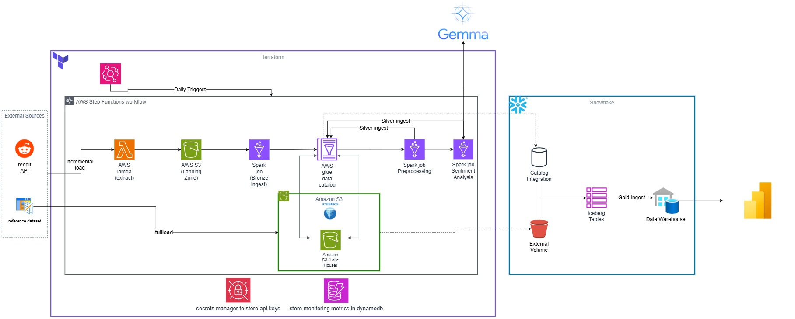

# Market Opinion Data Platform

**Turn Social Chatter into Competitive Advantage.**

An enterprise-grade data intelligence platform that transforms millions of unstructured Reddit discussions into actionable market insights. Built for smartphone brands, product managers, and market researchers who need to understand the "why" behind customer sentiment.



---

## 🚀 Business Value

In the hyper-competitive smartphone market, understanding customer sentiment in real-time is the difference between leading the market and playing catch-up.

### 🎯 Competitive Intelligence
- **Benchmarking**: Compare your brand's reputation directly against competitors (e.g., Samsung vs. Apple vs. Google) in real-time.
- **Trend Detection**: Spot emerging user complaints or viral features before they hit mainstream tech news.

### 💡 Product Development Insights
- **Feature-Level Granularity**: Don't just know *if* users like a phone—know *what* they like. Our AI breaks down sentiment by feature: **Camera**, **Battery**, **Display**, **Performance**, **Price**, and **Software**.
- **Authentic Feedback**: Tap into unfiltered, authentic discussions from power users and enthusiasts on Reddit, avoiding the bias of traditional surveys.

### 📊 Market Research at Scale
- **Data-Driven Decisions**: Replace "gut feeling" with hard data backed by thousands of user discussions.
- **Historical Analysis**: Track how sentiment shifts over time after software updates or new product launches.

---

## 🏗️ Architecture & Technology

Built on a robust **Event-Driven, Serverless Architecture**, this platform is designed for scale, reliability, and cost-efficiency.

### The "Medallion" Data Lakehouse
We use a multi-layer **Apache Iceberg** architecture to ensure data quality and lineage:

1.  **Landing Zone (S3)**: Raw JSON data ingestion from Reddit.
2.  **Bronze Layer**: Deduplicated, raw tables ensuring a complete history.
3.  **Silver Core**: Cleaned, standardized data ready for analysis.
4.  **Silver Sentiment (AI)**: Enriched data with **Google Gemini Flash** AI sentiment scores.
5.  **Gold Layer (Snowflake)**: Analytics-ready data marts for business intelligence dashboards.

### ❄️ Snowflake Analytics Layer
We bridge the gap between data engineering and business intelligence using **Snowflake**.

-   **Zero-Copy Integration**: Snowflake directly reads the Silver Iceberg tables from S3 using a **Glue Catalog Integration**, eliminating redundant data copies.
-   **Star Schema Data Mart**:
    -   `fact_brand_mentions`: The central metric table linking sentiment scores to products and time.
    -   `dim_product`: Rich product specifications (982+ models).
    -   `dim_date`: Time dimension for trend analysis.

### Key Technologies
-   **Compute**: AWS Lambda (serverless ingestion), AWS Glue (Spark-based ETL).
-   **Orchestration**: AWS Step Functions & EventBridge.
-   **AI/ML**: Google Gemini 1.5 Flash for high-speed, cost-effective aspect-based sentiment analysis.
-   **Storage**: Amazon S3 & DynamoDB.
-   **IaC**: Fully automated deployment with **Terraform**.

---

## ⚡ Quick Start

Follow these steps to deploy the platform in your own AWS environment.

### Prerequisites
-   **AWS Account** with Admin permissions.
-   **Terraform** (v1.0+) and **AWS CLI** installed.
-   **Reddit API Credentials** (Client ID, Secret).
-   **Google Gemini API Key**.

### 1. Build & Package
The platform uses Python-based Lambda functions and Glue scripts. You must build the dependencies first.

```bash
# Clone the repository
git clone <repository-url>
cd market-opinion-data-platform

# 1. Build the Ingestion Lambda
./scripts/build_lambda.sh

# 2. Build the Sentiment Analysis Library for AWS Glue
./scripts/build_glue_libs.sh
```

### 2. Configure Credentials
Store your sensitive API keys in AWS Secrets Manager:

```bash
aws secretsmanager create-secret \
  --name reddit_api \
  --secret-string '{"REDDIT_CLIENT_ID":"your-id","REDDIT_CLIENT_SECRET":"your-secret","REDDIT_USER_AGENT":"your-app"}'
```

### 3. Deploy Infrastructure
Deploy the Terraform layers in order. Update `aws/prod.tfvars` with your specifics first.

```bash
# Deploy S3 Buckets
cd aws/us-east-1/10_s3 && terraform init && terraform apply -var-file=../../prod.tfvars

# Deploy Database Tables
cd ../11_dynamodb && terraform init && terraform apply -var-file=../../prod.tfvars

# Deploy Ingestion Lambda
cd ../20_lambda && terraform init && terraform apply -var-file=../../prod.tfvars

# Deploy Glue Jobs (Bronze)
cd ../21_glue && terraform init && terraform apply -var-file=../../prod.tfvars

# Deploy Enrichment Jobs (Silver - Sentiment Analysis)
cd ../22_glue_enrichment && terraform init && terraform apply -var-file=../../prod.tfvars

# Deploy Workflow Orchestration
cd ../30_stepfunction && terraform init && terraform apply -var-file=../../prod.tfvars

# Enable Scheduling
cd ../40_eventbridge && terraform init && terraform apply -var-file=../../prod.tfvars
```

---

## 📈 Observability & Monitoring

We believe in "Production-Grade" engineering. The platform comes with built-in observability:

-   **Dashboard**: Track ingestion rates, API usage, and system health.
-   **Alerts**: Receive notifications for failed ingestion runs or API rate limits.
-   **Logs**: Centralized CloudWatch logs for deep-dive debugging.

---

## 📜 Repository Structure

-   `aws/`: Terraform infrastructure code, organized by layers.
-   `lambda/`: Source code for the Reddit Ingestion Lambda.
-   `modules/`: Shared Python libraries (Reddit client, Sentiment Analysis logic).
-   `scripts/`: Build and utility scripts.
-   `snowflake_models/`: SQL models for the downstream Analytics layer.

---

## 🛡️ License

This project is licensed under the MIT License.
